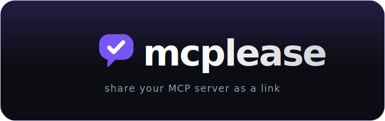
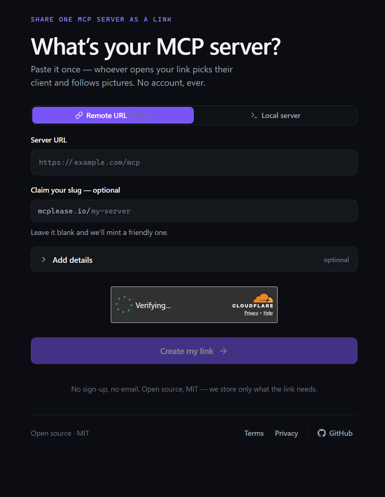
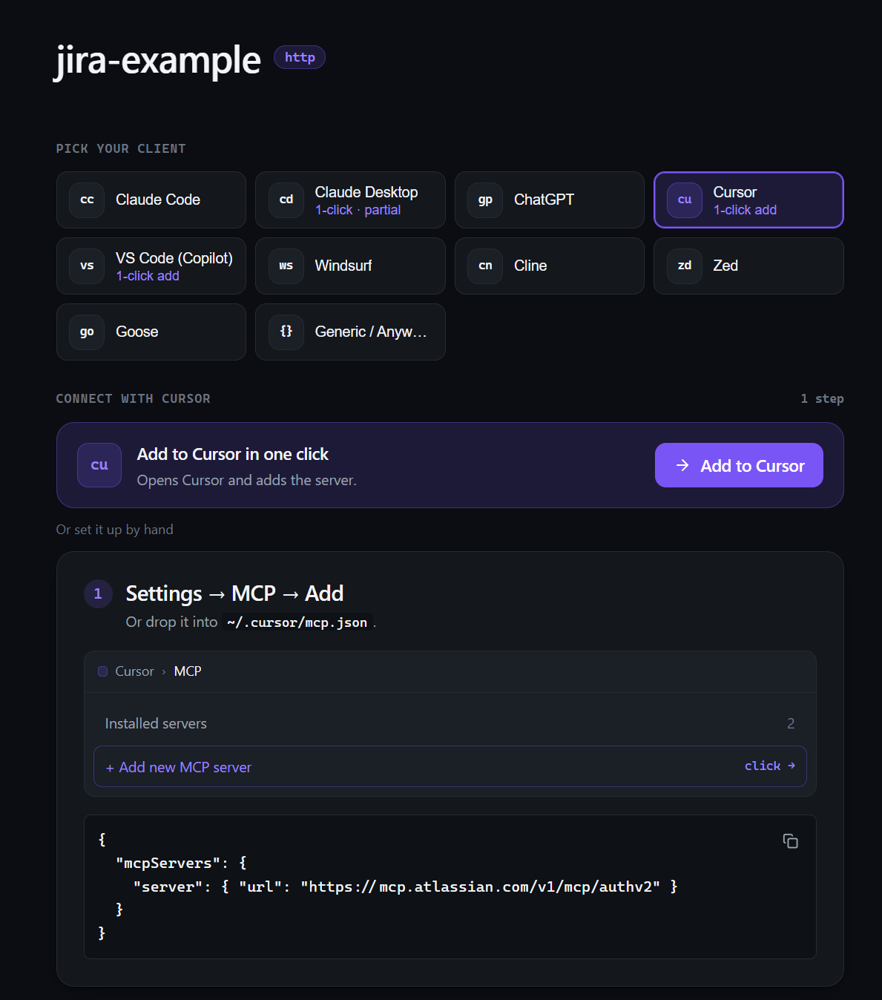

<div align="center">



<h3>Share your MCP server as a link.</h3>

<p>
Paste your MCP server <b>once</b> — get <code>mcplease.io/&lt;slug&gt;</code>, a page that shows whoever<br/>
opens it exactly how to connect from <i>their</i> client: picture-led steps, copy-paste<br/>
commands, and one-click install wherever the client supports it.
</p>

<p>
<a href="https://mcplease.io/jira-example"></a>
</p>

<p>
<a href="https://github.com/daretodave/mcplease/actions/workflows/ci.yml"></a>


<a href="./LICENSE"></a>
</p>

<p>


</p>

<p>


</p>

<b><a href="https://mcplease.io">Live</a> · <a href="#how-it-works">How it works</a> · <a href="#the-readme-badge">The badge</a> · <a href="#supported-clients">Clients</a> · <a href="#develop">Develop</a> · <a href="#architecture-at-a-glance">Architecture</a> · <a href="#faq">FAQ</a></b>

</div>

---

> **No directory. No account. Ever.** Just the shortest path between "here's my MCP server" and someone else actually running it.

## What is this

Connecting an MCP server today means the author hand-writes a **setup matrix** — a different ritual per client: `claude mcp add …` here, a JSON blob keyed `url` in one tool and `serverUrl` in the next, a GUI click-path elsewhere, an OAuth dance somewhere in the middle. A big company can afford to publish and maintain that page. Most authors just paste a bare URL into a README and hope the reader knows their own client.

**mcplease generates that page for any server, from one paste** — and hands you a badge to advertise it.

## See it

<table>
  <tr>
    <td width="50%" valign="top"><b>1 · You paste it once</b><br/><sub>A remote HTTP URL or a local stdio server. Claim a slug or let us mint one. No sign-up.</sub></td>
    <td width="50%" valign="top"><b>2 · They connect from <i>their</i> client</b><br/><sub>Whoever opens the link picks their client and follows pictures — or clicks <b>Add</b> where supported.</sub></td>
  </tr>
  <tr>
    <td valign="top"></td>
    <td valign="top"></td>
  </tr>
</table>

And every link **unfurls with a generated preview card** — dropped into Slack, a GitHub issue, or a README, it renders as a proper card, not a naked URL.

## How it works

1. **Paste** your MCP server — a remote **HTTP** URL, or a local **stdio** server (clone → build → run).
2. **Get** a shareable link `mcplease.io/<slug>` — plus a one-time edit link. No account.
3. **Share** it. Whoever opens it picks their client and follows image-driven, copy-paste steps — or clicks **Add** where the client supports one-click install.
4. **Advertise** it with the README badge, so anyone can connect in one click.

## The README badge

Every link ships an embeddable, edge-cached shield. Drop it in your repo and let people connect straight from your README:

[](https://mcplease.io/jira-example)

<details open>
<summary><b>Copy-paste</b></summary>

**Markdown**

```md
[](https://mcplease.io/jira-example)
```

**HTML**

```html
<a href="https://mcplease.io/jira-example">
  
</a>
```

</details>

Two variants share one shield (left segment is always the brand mark + `MCP`):

| Variant                    | Renders                                       | Use                                      |
| -------------------------- | --------------------------------------------- | ---------------------------------------- |
| **connect** _(default)_    | accent **Connect to MCP** call-to-action      | the button you want people to click      |
| **info** `?variant=info`   | neutral **‹name› · ‹transport›**, read live   | a quiet "what is this" chip in your docs |

Delete the link and the badge quietly degrades to an honest **link not found** shield — a removed server never leaves a broken image in someone else's README.

## Supported clients

One paste fans out to every client below. The connect page hides what doesn't apply — a `stdio` link won't offer remote-only ChatGPT; an `http` link skips the clone-and-build dance.

| Client                 | How you connect                          |
| ---------------------- | ---------------------------------------- |
| **Claude Code**        | Guided — `claude mcp add …`              |
| **Claude Desktop**     | ⚡ One-click _(partial)_                  |
| **ChatGPT**            | Guided (remote servers)                  |
| **Cursor**             | ⚡ One-click                             |
| **VS Code (Copilot)**  | ⚡ One-click                             |
| **Windsurf**           | Guided                                   |
| **Cline**              | Guided                                   |
| **Zed**                | Guided                                   |
| **Goose**              | Guided                                   |
| **Generic / Anywhere** | Copy-paste config for any MCP client     |

## Architecture at a glance

A small product with strong opinions — **every rule below is a CI gate, not a reviewer's memory.**

- 🧪 **Tests live beside code.** `foo.ts` ships `foo.test.ts` _next to it_; a structure check fails the build on any testable module without its neighbour. Behavior, never snapshots. **307 tests** across **55 co-located files**.
- 🔒 **One module names the vendor.** Only `@mcplease/data` imports `@supabase/supabase-js`; everything else calls a domain API (`data.links.*`) — never a table name, never the vendor. Lint enforces the seam.
- 🔑 **No accounts, one secret.** The browser only ever holds the **anon** key against `SECURITY DEFINER` RPCs. The **service-role key lives in exactly one file** — the create endpoint. Editing is gated by an unguessable UUID token, re-hashed and verified inside the RPC.
- 🎛️ **State has three planes.** UI → **Zustand** · server data → **TanStack Query** · React Context is _lint-banned_ (a re-render footgun).
- 🎨 **Tokens, not hexes.** PandaCSS with `strictTokens: true` — a raw hex is a compile error. An agnostic token core emits structured values; a guard keeps it vendor-free so it could re-skin to any renderer.
- 📈 **Analytics is a typed taxonomy.** Every event flows through `@mcplease/analytics` `track.*` — low-cardinality enums only, never a server URL, never PII. Raw `dataLayer` access is lint-banned outside the package.

Deep dive: [CLAUDE.md](./CLAUDE.md) is the full build contract.

## Stack

- **Web** — React 19 + Vite 6 + `react-router-dom` 7, Zustand, TanStack Query, PandaCSS — a static SPA on **Cloudflare Pages**.
- **Edge** — Cloudflare **Pages Functions**: per-link meta injection, the OG social card (`workers-og` / Satori), the README badge, and the create endpoint.
- **Data** — **Supabase** Postgres: one `links` table behind `SECURITY DEFINER` RPCs; hand-written, timestamped migrations are the schema authority.
- **Anti-abuse** — Cloudflare **Turnstile**. **Analytics** — GA4, anonymous.
- **Toolchain** — TypeScript 5.9, npm workspaces, Vitest + Playwright, ESLint (flat) + Prettier, Lefthook, all pinned exactly on the load-bearing floor.

## Project layout

An **npm-workspaces** monorepo (Node 20). Internal packages export TypeScript **source directly** — no per-package build step, no `dist/` to drift.

```text
app/
├─ apps/web/              # Vite 6 + React 19 SPA  ·  functions/ = Cloudflare Pages Functions
│  └─ functions/
│     ├─ [slug].ts        # inject per-link <meta>/OG tags into the SPA shell
│     ├─ og/[slug].ts     # the OG social card (workers-og)
│     ├─ badge/[slug].ts  # the embeddable README shield
│     └─ api/links.ts     # the create endpoint — the one home of the service-role key
├─ packages/
│  ├─ model/              # DB types + the shared shapes both sides use (names no vendor)
│  ├─ data/               # the sealed Supabase seam — the only module that imports the vendor
│  ├─ slug/               # slug rules: [a-z0-9-], 2–40, no edge/double dash, reserved set
│  ├─ client-matrix/      # the typed table of connect targets — one row per client
│  ├─ analytics/          # the typed GA4 event taxonomy (track.*)
│  └─ theme/              # agnostic design tokens + the PandaCSS preset
├─ scripts/               # the house checkers: co-located · agnostic-seam · bundle-budget
└─ supabase/              # config.toml + hand-written migrations/ + seed.sql
```

## Develop

```bash
npm install      # also wires git hooks (Lefthook) + generates the Panda styled-system
npm run dev      # the web app at apps/web
npm test         # Vitest, with per-package coverage gates
npm run e2e      # Playwright — hermetic, against the production bundle, zero sleeps
npm run build    # tsc + vite build → apps/web/dist  (then the gzip bundle-budget gate)
```

The full CI gate runs locally too, and `pre-push` mirrors it exactly:

```bash
npm run typecheck        # tsc --noEmit across the workspaces (+ the functions project)
npm run lint             # eslint . --max-warnings 0  (the seam / Context / dataLayer bans)
npm run format:check     # prettier --check
npm run test:structure   # the co-located-test law
npm run test:agnostic-seam
```

## Quality gates

CI (GitHub Actions, Node 20 pinned) fans out at `t=0` — **build** (+ bundle budget) · **unit** (coverage) · **checks** (typecheck · lint · format · structure · agnostic-seam) · **e2e** (a Playwright smoke against the real production bundle). On push to `main`, a serial tail follows: **migrate** (`supabase db push` to the cloud project) → **deploy** (`wrangler pages deploy` of the gated artifact). Schema leads the app.

Coverage gates: **85%** for the app and `data`; **95%** for `theme`, the pure-logic packages (`slug`, `client-matrix`, `analytics`, `model`), and `scripts/`. Every workspace clears its gate today — **100% across the packages, 98.8% statements in the app**.

## FAQ

**Do I need an account?** No — never. You get a public link plus a one-time **edit link** (an unguessable token). There's nothing to sign up for and nothing to log into; lose the edit link and the page stays up, you just can't change it.

**Why not just paste the raw server URL in my README?** Because a bare URL makes every reader do the per-client ritual themselves. mcplease turns it into a page that already knows Claude Code from Cursor from ChatGPT — pictures, copy-paste commands, and one-click where the client supports it.

**Why not a public directory?** Directories rot, and they turn into a discovery-and-moderation problem. mcplease has none: your link lives next to _your_ server, you own it, and there's nothing to browse, rank, or game.

**Is my link private?** It's public-by-URL — anyone with the link can see how to connect, which is the whole point of sharing it. There are no accounts, and analytics is anonymous and never records your server URL. Share links to servers you're comfortable handing out.

**Can I self-host?** Yes. It's MIT and runs entirely on your own **Cloudflare Pages + Supabase** — see [Develop](#develop). The hosted `mcplease.io` is simply the zero-setup path.

## Contributing

PRs welcome — the gates _are_ the review, so if it's green it's most of the way there. Conventions for working in the tree live in [CLAUDE.md](./CLAUDE.md): kebab-case files and folders, co-located tests asserting behavior, exact pins on the framework floor, and **no attribution footer on commits**.

## License

[MIT](./LICENSE) — no strings.
